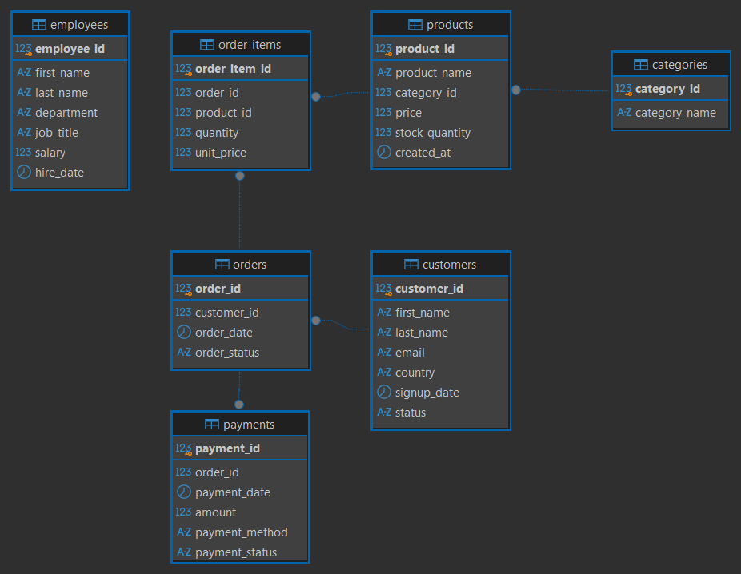

# 🛒 E-Commerce Practice Database

This database was created as the practice environment for my **SQL Practice Workbook**.

It is designed to provide a realistic e-commerce dataset for practicing SQL queries, database relationships, and data analysis.

## 🗄️ Database

The database was developed using:

* **PostgreSQL**
* **DBeaver**

The database contains multiple related tables representing an e-commerce system and is designed specifically for hands-on SQL practice.

## 📊 Database Schema



## 📂 Project Structure

```text
ecommerce_db/
│
├── script_0.sql
├── script_1.sql
├── database.png
└── README.md
```

## 📄 SQL Scripts

### `script_0.sql`

Contains the database structure and setup required for the practice database.

### `script_1.sql`

Contains the SQL statements and queries used to work with the database.

Together, these scripts provide the database environment required for the exercises in the SQL Practice Workbook.

## 🎯 Purpose

The main purpose of this database is to provide a practical environment for learning and practicing SQL using a realistic business scenario.

It can be used to practice:

* `SELECT` statements
* `WHERE` conditions
* `ORDER BY`
* `GROUP BY`
* Aggregate functions
* `JOIN`s
* Subqueries
* Data filtering
* Data analysis
* Relational database concepts

## 🛠️ Tools & Technologies

**Database:** PostgreSQL
**Database Client:** DBeaver
**Language:** SQL

## 🚀 Getting Started

1. Install PostgreSQL.
2. Open the SQL scripts in DBeaver.
3. Run `script_0.sql` to set up the database.
4. Run `script_1.sql` to populate and/or work with the database.
5. Use the database together with the exercises from the SQL Practice Workbook.

## 📚 Related Project

This database was created specifically for my **SQL Practice Workbook**, which contains hands-on SQL exercises based on the e-commerce dataset.

---

**Created by Tahmina Aliyeva**
